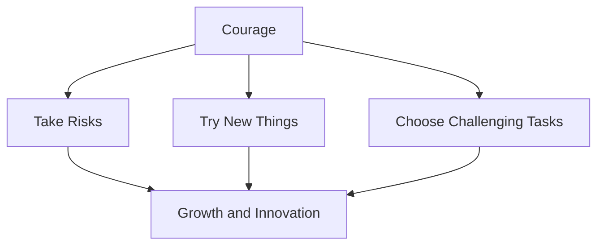
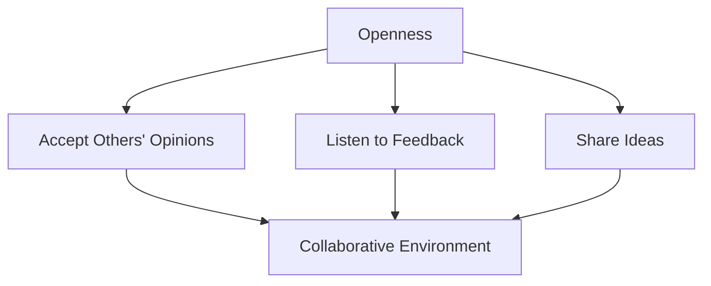

# Agile Principles and Mindset

## Introduction

Agile is a mindset that focuses on delivering products to customers in the required time with the best quality. It's not just a methodology, but a way of thinking that should be adopted by everyone in the team.

## Working in an Agile Environment

When we say we work in an Agile environment or with an Agile approach, we're referring to a specific set of principles and practices that guide our work.

## The Role of an Agile Coach

An Agile coach, often certified in Agile methodologies, is the best person to explain and implement Agile practices. In many cases, the Scrum Master serves as the Agile coach for the team.

## Work Agreement and Agile Principles

Before starting work together, teams often establish a work agreement that includes key Agile principles. These principles should be applied throughout the project:

### 1. Commitment

When a team lead assigns a task, team members should commit to completing it. This principle ensures reliability and builds trust within the team.

### 2. Courage

Courage in Agile means:
- Being willing to take risks
- Not always choosing the easiest path
- Having the bravery to work on new and challenging tasks
- Stepping out of your comfort zone to learn and grow

### 3. Focus

Focus is crucial throughout the project lifecycle:

- Start by thoroughly reading and understanding the Software Requirements Specification (SRS)
- Maintain focus during implementation to meet all business requirements
- Pay attention to each step, practicing separation of concerns
- Invest time in reading documentation and learning new technologies

> "Minutes spent reading documentation are better than hours spent not knowing how to implement."

### 4. Openness

An open mindset involves:
- Accepting and considering others' opinions
- Being receptive to feedback
- Sharing your own ideas freely

### 5. Respect

Respect is a fundamental principle in Agile and should be the default behavior for all team members. It fosters a positive work environment and enhances collaboration.

## Conclusion

Adopting these Agile principles helps teams deliver high-quality products efficiently. Remember, Agile is not just about following a set of rules, but about embracing a mindset that values flexibility, collaboration, and continuous improvement.
