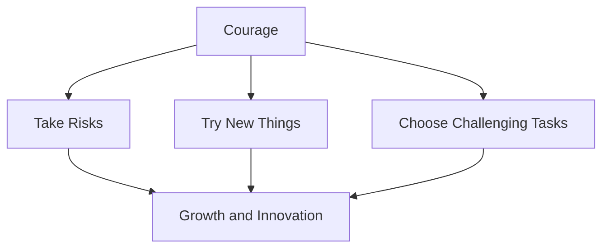
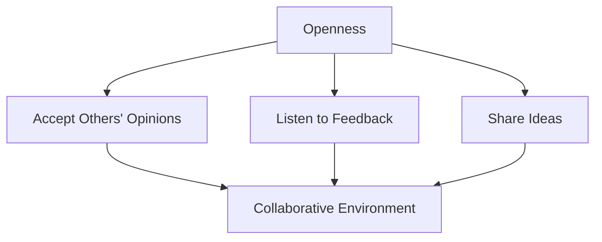
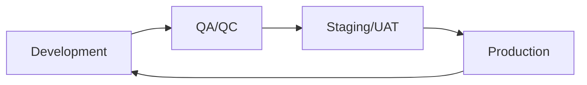
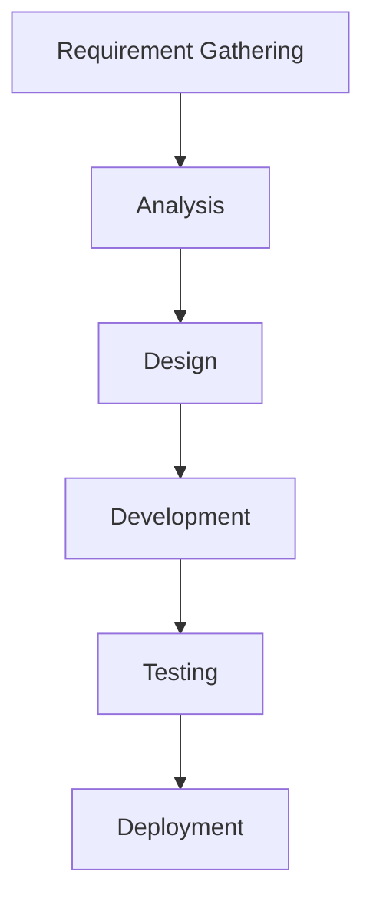
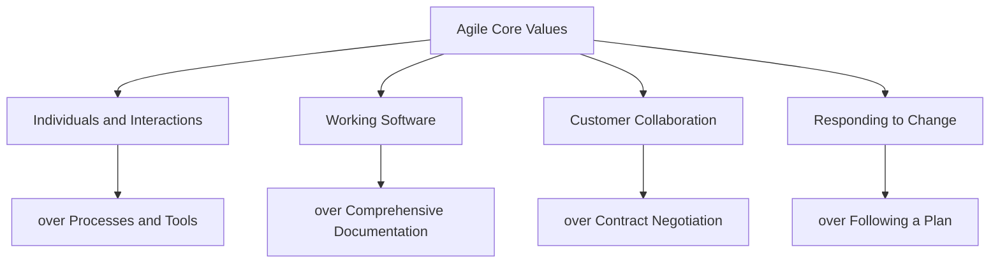

# Agile Principles and Mindset

## Introduction

Agile is a mindset that focuses on delivering products to customers in the required time with the best quality. It's not just a methodology, but a way of thinking that should be adopted by everyone in the team.

## Working in an Agile Environment

When we say we work in an Agile environment or with an Agile approach, we're referring to a specific set of principles and practices that guide our work.

## The Role of an Agile Coach

An Agile coach, often certified in Agile methodologies, is the best person to explain and implement Agile practices. In many cases, the Scrum Master serves as the Agile coach for the team.

## Work Agreement and Agile Principles

Before starting work together, teams often establish a work agreement that includes key Agile principles. These principles should be applied throughout the project:

### 1. Commitment

When a team lead assigns a task, team members should commit to completing it. This principle ensures reliability and builds trust within the team.

### 2. Courage

Courage in Agile means:
- Being willing to take risks
- Not always choosing the easiest path
- Having the bravery to work on new and challenging tasks
- Stepping out of your comfort zone to learn and grow

### 3. Focus

Focus is crucial throughout the project lifecycle:

- Start by thoroughly reading and understanding the Software Requirements Specification (SRS)
- Maintain focus during implementation to meet all business requirements
- Pay attention to each step, practicing separation of concerns
- Invest time in reading documentation and learning new technologies

> "Minutes spent reading documentation are better than hours spent not knowing how to implement."

### 4. Openness

An open mindset involves:
- Accepting and considering others' opinions
- Being receptive to feedback
- Sharing your own ideas freely

### 5. Respect

Respect is a fundamental principle in Agile and should be the default behavior for all team members. It fosters a positive work environment and enhances collaboration.

## Conclusion

Adopting these Agile principles helps teams deliver high-quality products efficiently. Remember, Agile is not just about following a set of rules, but about embracing a mindset that values flexibility, collaboration, and continuous improvement.

## Common Agile Myths

There are several myths about Agile that need to be addressed:

1. **Customers know exactly what they want**: While customers know their business, they may not always know the exact details of what they need in a software solution.

2. **Developers know exactly what they're building**: Developers may have a good understanding of the technical aspects, but may not always grasp all the business implications.

3. **Nothing will change along the way**: Change is inevitable in most projects. The Agile approach helps create projects that can accept change requests at any time without causing major problems.

## Agile Process: IRKIWIEI

IRKIWIEI stands for "I'll Really Know It When I Experience It". This concept is central to the Agile approach, emphasizing the importance of iterative development and feedback.

## Project Lifecycle

In an Agile project, we divide the work into modules and services. Each service goes through four main processes:

1. **Development (DEV)**
2. **Quality Assurance/Quality Control (QA/QC)**
3. **Staging/User Acceptance Testing (UAT)**
4. **Production (PROD)**

### Detailed Workflow

1. **Business Requirements**:
   - Business consultants document requirements in SRS (Software Requirements Specification) or RD (Requirements Document).
   - This document is delivered to development and testing teams.

2. **Development**:
   - Frontend and backend developers start working on implementation.
   - Testers begin writing test cases based on business requirements.

3. **Testing**:
   - Developers deploy the service to the testing server.
   - Testers execute test cases (manually or through automation).

4. **Smoke Testing**:
   - Developers create a "smoke" work item to indicate a service is ready for testing.
   - This is managed through platforms like Azure DevOps or Jira.

5. **Bug Tracking and Fixing**:
   - Testers create bug work items for issues found.
   - Developers fix bugs and redeploy.
   - Critical bugs may stop the smoke testing process.

6. **Staging and UAT**:
   - Service is deployed to the staging server.
   - Business consultants demonstrate the service to the customer.
   - Customer provides feedback (UAT comments or Change Requests).

7. **Production**:
   - If everything is approved, the service goes live in production.

## Tools and Platforms

- Azure DevOps or Jira are commonly used for managing Agile workflows.
- These platforms allow creation of work items like tasks, bugs, and smoke tests.
- They facilitate communication between team members and track project progress.

## Conclusion

The Agile approach, with its iterative processes and emphasis on communication, helps teams navigate the complexities of software development. It acknowledges that requirements may change and encourages adaptability throughout the project lifecycle.

## Agile vs. Waterfall Approach

### Waterfall Approach

Before Agile, the Waterfall approach was commonly used in project management. This linear sequential approach follows these steps:

1. Requirement gathering
2. Analysis
3. Design
4. Development
5. Testing
6. Deployment

In the Waterfall model, each phase must be completed before the next phase begins. This often resulted in long project timelines, sometimes spanning years, with minimal customer interaction between the initial requirements gathering and final delivery.

### Comparison with Agile

While Agile incorporates similar processes to Waterfall, it applies them iteratively to smaller units of work (services or features) rather than the entire project at once. This allows for:

- More frequent customer interaction and feedback
- Greater flexibility to accommodate changes
- Earlier detection and correction of issues

Waterfall can still be effective for small projects with well-defined, unchanging requirements. However, Agile is generally preferred for larger, more complex projects where requirements may evolve over time.

## The Agile Growth Mindset

A key aspect of successful Agile implementation is fostering a growth mindset among team members. Here's a comparison of growth mindset characteristics versus a fixed mindset:

| Growth Mindset | Fixed Mindset |
|----------------|---------------|
| Analyze mistakes and learn from them | Unchangeable mind |
| Accept and seek out challenges | Avoid challenges, fear new things |
| Strive to meet and exceed expectations | Avoid failure, fear of interviews |
| Persist in face of obstacles | Give up easily |
| Inspired by others' success | Threatened by others' success |
| Ability and eagerness to learn new things | Belief that abilities are fixed |

### Characteristics of an Agile Growth Mindset

1. **Analyze Mistakes**: When bugs are reported, team members should:
   - Investigate the root cause
   - Reflect on whether it was due to lack of focus, incomplete requirements, or rushed implementation
   - Use the insights to improve future work

2. **Accept Challenges**: Team members should:
   - Choose challenging tasks over easy ones
   - Strive to meet and exceed expectations
   - Aim for exceptional results

3. **Continuous Learning**: Embrace opportunities to learn new technologies and methodologies

4. **Inspiration from Peers**: Be inspired by colleagues who excel and exceed expectations

5. **Problem-Solving Persistence**: When facing obstacles:
   - Prepare and try multiple solutions before escalating
   - When seeking help, demonstrate the attempts made to solve the problem

By cultivating these qualities, Agile team members contribute to the overall success and continuous improvement of the project.

## Conclusion

The Agile methodology, with its iterative approach and emphasis on adaptability, represents a significant evolution from the Waterfall model. Central to its success is the cultivation of a growth mindset among team members. This mindset, characterized by a willingness to learn, accept challenges, and continuously improve, enables Agile teams to navigate the complexities of modern software development effectively.

## Core Values of Agile

Agile methodology is built upon four fundamental values that guide decision-making and prioritization in project management. These values, as outlined in the Agile Manifesto, are:

### 1. Individuals and Interactions over Processes and Tools

- Emphasizes the importance of team dynamics and communication
- Recognizes that the people on a project and how they work together are more critical to success than the tools and processes they use
- Promotes harmony and mutual support within the team

### 2. Working Software over Comprehensive Documentation

- Prioritizes delivering functional software over extensive documentation
- Focuses on tangible results rather than just plans or discussions
- Encourages a "show, don't tell" approach to demonstrating progress

### 3. Customer Collaboration over Contract Negotiation

- Emphasizes building a cooperative relationship with the customer
- Promotes ongoing engagement and feedback from the customer throughout the project
- Values being helpful and responsive to customer needs over rigid adherence to initial contract terms

### 4. Responding to Change over Following a Plan

- Acknowledges that change is inevitable in software projects
- Prioritizes flexibility and adaptability in the face of changing requirements
- Encourages teams to be prepared for and embrace change requests at any point in the project

These values do not dismiss the items on the right (processes and tools, documentation, contracts, and plans) as unimportant. Rather, they emphasize that the items on the left should be valued more highly. This shift in priorities is what enables Agile teams to be more flexible, responsive, and ultimately more successful in delivering value to their customers.

## Applying Agile Values in Practice

1. **Foster a Collaborative Environment**: Encourage open communication and teamwork. Set up regular stand-ups, retrospectives, and pair programming sessions to promote interaction.

2. **Deliver Early and Often**: Focus on creating working increments of software that can be demonstrated to stakeholders. Use techniques like continuous integration and deployment to ensure regular delivery of working software.

3. **Engage Customers Regularly**: Involve customers or their representatives in sprint reviews, demos, and planning sessions. Be open to their feedback and willing to adjust priorities based on their input.

4. **Embrace Change**: Maintain a flexible backlog and be prepared to reprioritize based on new information or changing market conditions. Use short sprints or iterations to allow for frequent reassessment and course correction.

By adhering to these core values, Agile teams can create an environment that is responsive to change, focused on delivering value, and built on strong relationships both within the team and with customers.

## The 12 Principles of Agile

In addition to the four core values, Agile is guided by 12 principles that help teams implement and embody the Agile mindset:

1. **Satisfy the Customer**: Our highest priority is to satisfy the customer through early and continuous delivery of valuable software.

2. **Welcome Changing Requirements**: Embrace changing requirements, even late in development. Agile processes harness change for the customer's competitive advantage.

3. **Deliver Working Software Frequently**: Deliver working software frequently, from a couple of weeks to a couple of months, with a preference to the shorter timescale.

4. **Collaborate Daily**: Business people and developers must work together daily throughout the project.

5. **Motivated Individuals**: Build projects around motivated individuals. Give them the environment and support they need, and trust them to get the job done.

6. **Face-to-Face Conversation**: The most efficient and effective method of conveying information to and within a development team is face-to-face conversation.

7. **Measure Progress Through Working Product**: Working software is the primary measure of progress.

8. **Promote Sustainable Development**: Agile processes promote sustainable development. The sponsors, developers, and users should be able to maintain a constant pace indefinitely.

9. **Continuous Attention to Technical Excellence**: Continuous attention to technical excellence and good design enhances agility.

10. **Simplicity is Essential**: The art of maximizing the amount of work not done is essential.

11. **Self-Organizing Teams**: The best architectures, requirements, and designs emerge from self-organizing teams.

12. **Regularly Reflect on Continuously Improving**: At regular intervals, the team reflects on how to become more effective, then tunes and adjusts its behavior accordingly.

## Effectiveness of Communication Channels

The principle of face-to-face conversation is particularly important in Agile methodologies. The following image illustrates the effectiveness of different communication channels:

)

Key points from the image:

- Face-to-face communication at a whiteboard is the most effective form of communication.
- Video recording is more effective than email or paper communication.
- The effectiveness of communication channels increases with their "richness" or "temperature".
- Channels that allow for questions and answers are more effective than those that don't.

This image underscores why Agile methodologies emphasize face-to-face communication and co-location of teams when possible. It allows for immediate feedback, non-verbal cues, and quick resolution of misunderstandings, all of which contribute to more effective collaboration and problem-solving.

## Implementing the 12 Principles

To successfully implement Agile, teams should strive to embody these principles in their daily work:

1. Prioritize delivering value to the customer early and often.
2. Be flexible and adaptable to changing requirements.
3. Set up short development cycles with frequent deliveries.
4. Ensure daily communication between developers and business stakeholders.
5. Create a supportive environment that motivates team members.
6. Prioritize face-to-face communication whenever possible.
7. Use working software as the primary metric for progress.
8. Maintain a sustainable pace of work to avoid burnout.
9. Continuously improve technical practices and design.
10. Focus on simplicity and avoid unnecessary work.
11. Allow teams to self-organize and make decisions.
12. Hold regular retrospectives to reflect on and improve processes.

By adhering to these principles, Agile teams can create an environment that is responsive to change, focused on delivering value, and built on strong relationships both within the team and with customers.

